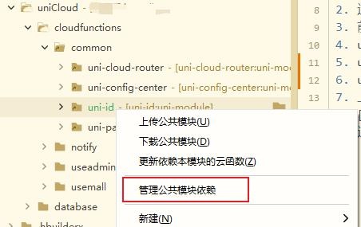
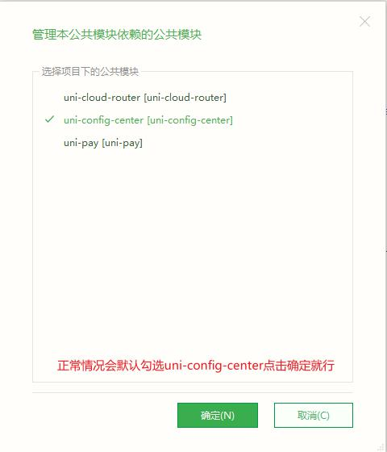
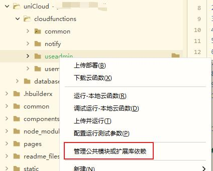
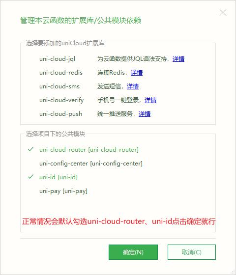
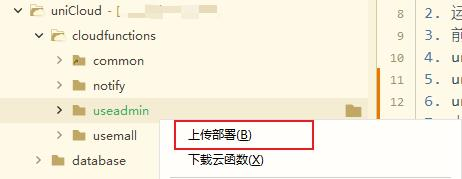
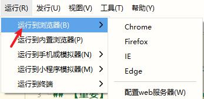

## 用云电商 uniCloud v1.0.9.230317 管理后台  

## 【重要】需先运行 [用云电商 uniCloud 版前后端开源](https://ext.dcloud.net.cn/plugin?id=5764) 项目
## 否则会遇到各种各样BUG，因为前端与管理后台关联同一个服务空间，管理后台依赖的公共模块在前端项目中。

## 项目运行步骤
1. 重新获取 manifest.json -> 应用标识 AppID
2. 运行当前项目终端，执行指令 npm i
3. 前端、后端项目关联同一个服务空间（注：需先操作前端项目的 uniCloud）
4. uniCloud -> cloudfunctions 右键 下载所有云函数、公共模块及 actions
5. uniCloud -> cloudfunctions -> common -> uni-id 右键 管理公共模块依赖
6. uniCloud -> cloudfunctions -> useadmin 右键 管理公共模块依赖
7. 上传部署 useadmin 云函数
8. [如前端已初始化，则跳过此步] uniCloud -> database -> db_init.json 右键 初始化云数据库
9. 运行 H5 版本 
10. 管理后台账号密码  
    admin
    1234
11. 如果登录失败，请确认 uniCloud 的云数据库表对应的密码是不是等于 637cf7595252a4bb63cc60fc2ad8850b5ca79c9f

##【密码错误】参考[https://ext.dcloud.net.cn/plugin?id=5211]常见问题 第2个